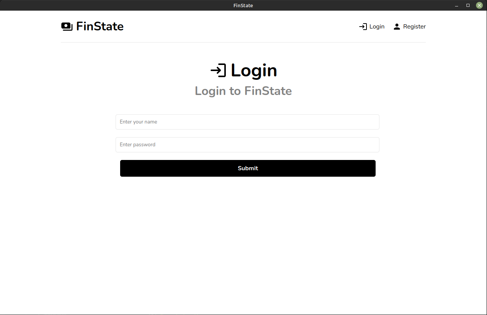
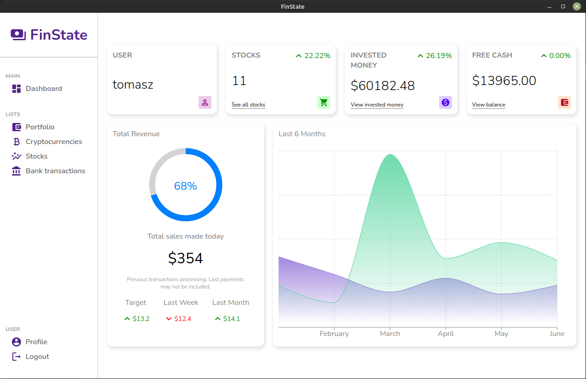
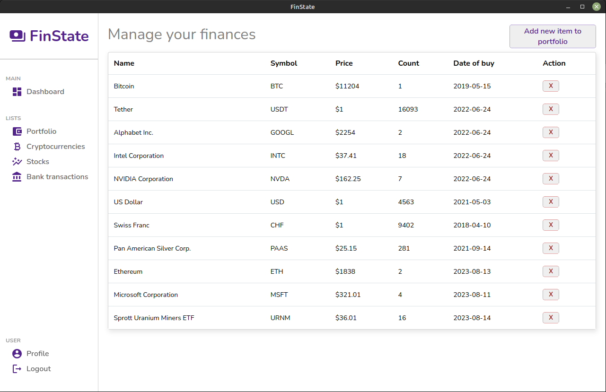
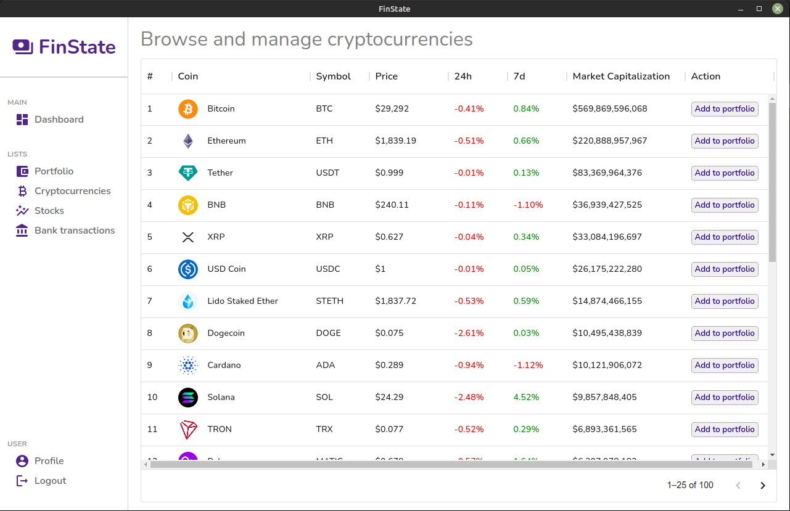
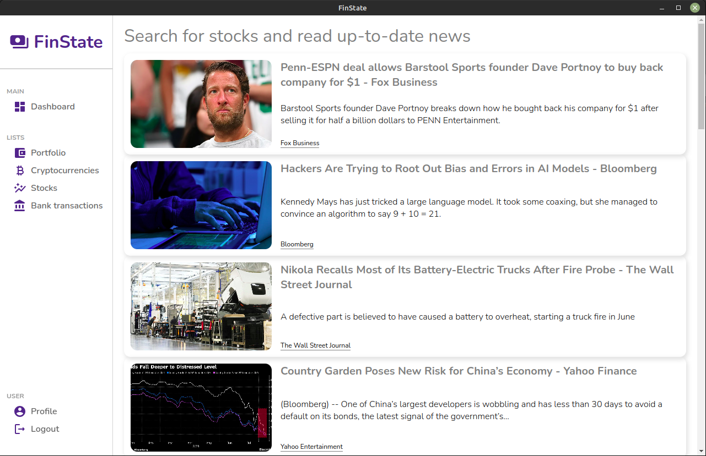

# FinState-Budget-Manager  
## _open source budget manager utilizing modern technologies_  

FinState is an budget manager created in MERN stack (MongoDB, Express, React, and Node.js).  
I created it as an final project for my classes at the University of Wrocław.  

## Features  

- Manage your stocks, cryptos, currencies, ETFs and track your portfolio value  
- Instantly view real-time cryptocurrency prices for up-to-date market insights  
- Stay informed with stock market news and analysis through an integrated feed  
- Secure access with JWT authentication for user-specific data  
- React frontend for responsive interface, Node.js backend with Express and MongoDB integration for efficient data management  


## Screenshots  
  
  
  
  
  


## Tech  

FinState uses those technologies to work properly:  

- [MongoDB] - flexible NoSQL database  
- [Express] - backend API framework  
- [React] - dynamic frontend library  
- [Node.js] - JavaScript runtime environment  

## Installation  

FinState requires [Node.js] to run.  

Clone the [repository][git-repo-url] and install required dependencies with npm.  

```sh  
git clone https://github.com/tTargiel/FinState-Budget-Manager.git  
cd FinState-Budget-Manager/  
npm install  
cd frontend/  
npm install  
```  

Make sure to create _.env_ file with following environment variables:  
```  
JWT_SECRET="<ANYTHING>"  
MONGO_URI=<DB-ADDRESS-TO-CONNECT-TO>  
NODE_ENV="production"  
```  

## License  

MIT  

**Free Software, Hell Yeah!**  

[//]: # (These are reference links used in the body of this note and get stripped out when the markdown processor does its job. There is no need to format nicely because it shouldn't be seen. Thanks SO - http://stackoverflow.com/questions/4823468/store-comments-in-markdown-syntax)  

[FinState]: <https://github.com/tTargiel/FinState-Budget-Manager>  
[git-repo-url]: <https://github.com/tTargiel/FinState-Budget-Manager.git>  
[MongoDB]: <https://www.mongodb.com/>  
[Express]: <https://expressjs.com/>  
[React]: <https://react.dev/>  
[Node.js]: <https://nodejs.org/>  
